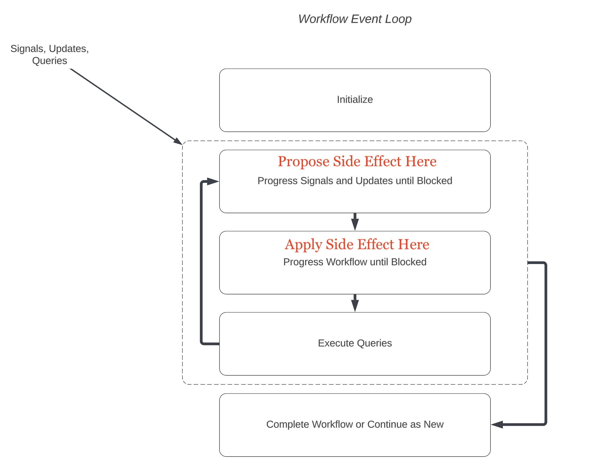

# Writes

There are two Temporal primitives used to externally mutate Workflow state once an Execution has started, **Signal** and **Update**.

## Foundations

It is important to understand how messages are processed by Signal and Update handlers to avoid subtle races and bugs. 
[This document](https://docs.temporal.io/encyclopedia/workflow-message-passing#handling-messages) explains why these
races might occur. 
These issues are only relevant when some form of blocking is required to apply a side effect 
caused by the input; for example, retrieving a result from an Activity inside a Signal handler.

> _Pay careful attention to its caution about interleaving message handlers if you intend to block to apply a side effect._

The question to ask is, "What is the safest, yet performant, way to apply side effects caused by an input?"

### Recommendations

Consider splitting side effects which demand asynchronous application into two stages:

1. **Propose**: Signal/Update Handler
1. **Apply**: Workflow Execution

This approach overlays rules on the diagram from the event loop in the above document as such:

#### The steps then become:

_Signal Handler_

1. Inside the Signal handler: Set (propose) the received input message onto common (shared) Workflow Execution state
2. Inside the Workflow main method: Apply the side effect(s) caused by the proposal (input).

_Update Handler_

In practice this means:
1. Inside the Update handler
   1. Set (propose) the received input message onto common (shared) Workflow Execution state
   2. Block until the expected side effect(s) have been completed if necessary for the response
   3. Respond with new state
2. Inside the Workflow main method: Apply the side effect(s) caused by the proposal (input).

## Signal
Signal employs "fire and forget" messaging semantics. This is used to send a message (even without data)
to impact the progress of an existing Workflow execution.
If the Workflow execution is not `Open` (or never existed), a **NotFound** error is received by the caller.
Signals are written to Execution history so are subject to the Signal count limits [here](https://docs.temporal.io/cloud/limits#per-workflow-execution-signal-limit).

**Signal** support hints that it can lead to Temporal being a drop-in replacement for a message queuing solution.
While this can often be true, there are some things to keep in mind:

### Throughput
Typical usage of Temporal Signals _per Execution_ is a few per second (sustained) though peaks up to 10-20 signals per second should not be a problem.
If you are considering a higher volume of Signals per second for a single Execution, consider a review of your design; you might
be missing an opportunity to think of business entities are workflows themselves in your application.

Note that Signal throughput is not just bound by Temporal limits. Your own Temporal Worker resource capacity implementation will throttle executions just like
any other message-based Consumer solution.

### Unknown Signals
Note that _all_ Signals sent to a Workflow Execution will contribute to its overall event history.
Keep this in mind if you are piping messages from some input like webhooks or a producer and might
receive extraneous message types your Workflow will not need to handle. Failure to do so could lead to
history bloat and cause problems with your Execution as it reaches its size limit.

### Dropped Signals
Temporal will not drop Signals, even those which arrive as an Execution is Closing.
If a race like this does occur, Temporal service will reject the Completed or ContinueAsNew request from the Worker allowing the buffered
Signals to be played before continuing on to either Close or ContinueAsNew the Execution.

## Update
The **Update** primitive allows Request-Reply messaging semantics.
Update has [phases](https://docs.temporal.io/encyclopedia/application-message-passing#updates) that are interesting to consider.

The "validation" phase of an Update can inspect current workflow state  to determine if the
Update should be "accepted" or not. Do _not_ put external calls (eg an `Activity` execution) 
into this phase to meet validation requirements.

## Refactor Our Use Case

#### Support the **Approve** or **Reject** Command that passes along details of the Owner (or Deputy Owner) reasons for Approval/Rejection.

We can do this by extending our `PUT /onboardings/{id}` endpoint with an `Approval` struct that accepts either `APPROVED` or `REJECTED` status with an optional `Comment`.
This means employing the "Create or Update" strategy for our Onboarding entity, but now we need to decide
whether we want to:
1. Check for existence of the `OnboardEntity` Workflow before sending our `ApproveOnboarding` Signal or
2. Try to send the appropriate Signal to the Workflow and handle the `NotFound` here
    1. This is what we will do for now since it saves us a round-trip to check for existence in most cases

#### Support the **SetEntityValue** Command that mutates the value

// TODO using Update
