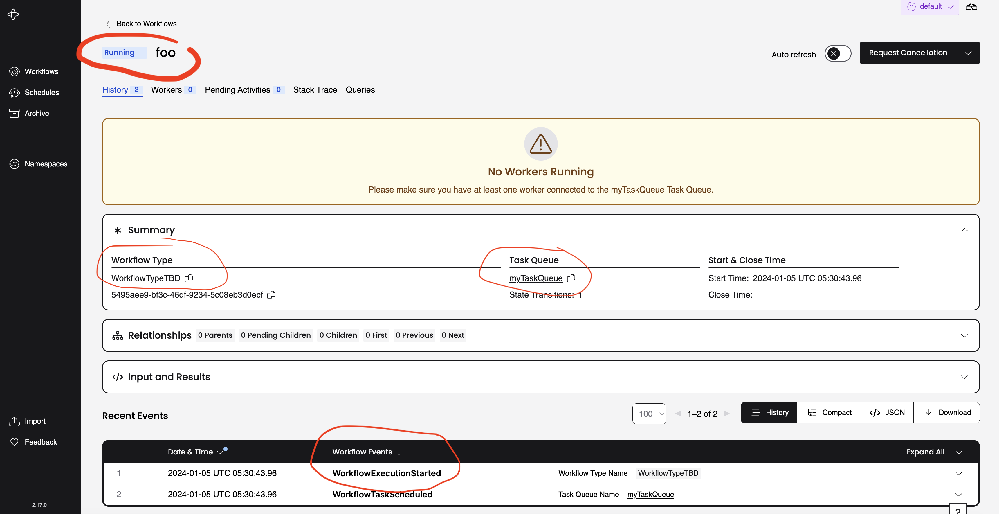

# The Temporal SDK Client: The Starter

How does a business process get started in Temporal?

This project demonstrates a typical scenario where an API that supports a User Interface receives a `POST` request 
that should start a workflow.

```
TODO://insert diagram
```

The `channels` package exposes an API Controller that has one endpoint defined as:
```
POST /workflows
Host: localhost:3030
Content-Type: application/json

{ "businessId": "foo" }

200 OK
```

The Temporal Client is `Autowired` into the [API Controller](src/main/java/io/temporal/jumpstart/sec_3/channels/APIController.java) to be used inside
the `POST` handler.
Note that Spring will autoconfigure the Temporal Workflow Client, but you can tune options as seen [here](src/main/java/io/temporal/jumpstart/sec_3/channels/TemporalOptionsConfig.java).


> The `newUntypedWorkflowStub` is being used in this example because we have not defined a `WorkflowInterface` yet. 

_To see this in action:_

1. Run `temporal server start-dev` to bring up Temporal services locally.
2. Run the [AppApplication](src/main/java/io/temporal/jumpstart/sec_3/AppApplication.java)
3. Call the POST endpoint
```
curl -H 'Content-Type: application/json' -d '{ "businessId":"foo"}' -X POST http://localhost:3030/workflows
```
4. Verify the workflow has been started in the Temporal Web UI at http://localhost:8233

Click on the workflow by id `foo` and you should see something  like

.

_Observe_:

1. The *WorkflowID* is `foo`. Prefer WorkflowIDs that have distinct business meaning instead of autogenerated UUIDs.
2. The *Workflow Type* is specified, but does not exist yet, as `WorkflowTypeTBD`. We will replace this with a statically typed Workflow type later.
3. The *Task Queue* is `myTaskQueue` and was passed in by the client when executing.
4. The *Event History* shows the `WorkflowExecutionStarted` which is always the first event in the history. That means Temporal Server successfully scheduled the Task to be picked up by our application to perform the Workflow!
  